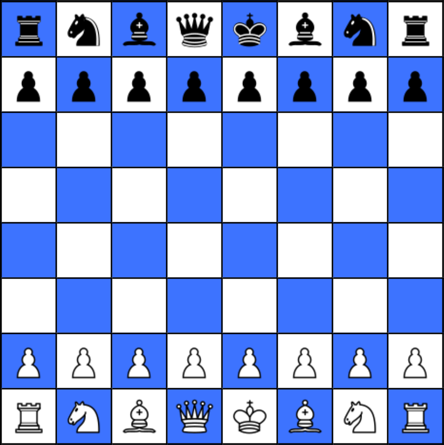

# Chess

This repository contains `game-engine` and `client` - a UI made in React for playing single player chess games.

## ⚙️ Setup

Prerequisites:

-   NodeJS (tested on version 18.20.8)
-   npm (tested on version 8.20.8)

```bash
# This command will install all required dependencies in all packages (thanks to npm workspaces)
npm i
```

## Available scripts

-   🚀 `start`: runs the `client` application
-   🔗 `postinstall` - links the packages (run automatically after `npm install`)
-   📦 `build`: links the packages and builds both `client` and `game-engine`
-   🧪 `test`: runs the tests in `game-engine` (and in `client` when implemented)
-   🧪 `test:watch`: same as above but in watch mode

## 🚧 Work progress

| Repository    | Progress     | Comments                                                                                              |
| ------------- | ------------ | ----------------------------------------------------------------------------------------------------- |
| `game-engine` | 🟩🟩🟩🟩🟩⬛ | mostly done, performance can be improved                                                              |
| `client`      | 🟩🟩🟩🟩🟩⬛ | movable pieces, en passant, castling, checks, checkmates, promotions are working, both sides playable (but there are responsivness issuesP) |

## Preview


