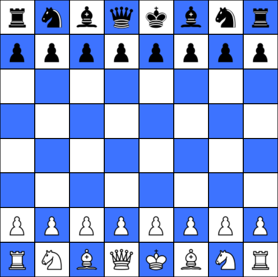

# Chess

This repository contains `game-engine` and `client` - a UI made in React for playing single player chess games.

## ⚙️ Setup

Prerequisites:

-   NodeJS

```bash
# This command will install all required dependencies in all packages (thanks to npm workspaces)
npm i
```

## Available scripts

-   🚀 `start`: runs the `client` application
-   🧪 `test`: runs the tests in `game-engine` (and in `client` when implemented)
-   🧪 `test:watch`: same as above but in watch mode

## 🚧 Work progress

| Repository    | Progress     | Comments                                                                     |
| ------------- | ------------ | ---------------------------------------------------------------------------- |
| `game-engine` | 🟩🟩🟩🟩🟩⬛ | mostly done                                                                  |
| `client`      | 🟩🟩🟩⬛⬛⬛ | movable pieces, en passant, castling, checks, checkmates working, promotions |

## Preview


