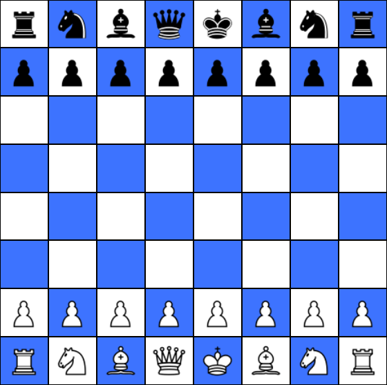

# Chess

This repository contains `game-engine` and `client` - a UI made in React for playing single player chess games.

## ⚙️ Setup

Prerequisites:

- [NodeJS](https://nodejs.org/en/download)
- npm (comes installed with NodeJS)
- [PostgreSQL](https://www.postgresql.org/download/)
- [pgAdmin](https://www.pgadmin.org/download/)
- [Insomnia REST API Client](https://insomnia.rest/download)

| Tool Versions         | Node.js | npm    |
|----------------------|---------|--------|
| Supported (variant 1) | 24.1.0  | 11.3.0 |
| Supported (variant 2) | 18.20.8 | 8.20.8 |

```bash
# Installs dependencies for all workspaces (client, server, game-engine, shared)
npm i
```

Setup pgAdmin and PostgreSQL (described in detail in [Server's Readme](./server/README.md))

## Monorepo and linking local packages

This repo is a single npm project with **workspaces** (see `workspaces` in the root `package.json`). The folders `client`, `server`, `game-engine`, and `shared` are separate packages, but one `npm i` at the repository root installs and wires them together.

### How local packages are connected (no `npm link`)

Previously, `client` and `server` depended on `game-engine` and `chess-shared` through `npm link` and a `postinstall` script. That is no longer used.

Instead, npm workspaces resolve **in-repo dependencies by package name**:

| Package       | `package.json` name | Used by              |
| ------------- | ------------------- | -------------------- |
| `shared/`     | `chess-shared`      | `client`, `server`   |
| `game-engine/`| `game-engine`       | `client`, `server`   |

In `client/package.json` and `server/package.json` those dependencies look like:

```json
"chess-shared": "*",
"game-engine": "*"
```

The `*` range means: use the workspace copy with the same name from this repository, not a version from the npm registry. After `npm i`, npm creates workspace links (you will see `"link": true` for these packages in `package-lock.json`). No extra script runs after install.

**What you get in practice:**

- Changes under `shared/` or `game-engine/` are visible to `client` and `server` immediately (same as with global `npm link`, but scoped to this repo).
- One shared `node_modules` tree at the root (hoisting), fewer duplicate installs.
- No manual `npm link` / `npm unlink` steps and no `postinstall` hook.

**Requirements:** run `npm i` only from the **repository root**, not separately inside `client/` or `server/` (unless you know you need an isolated install). Workspace wiring is defined at the root.

If you change only TypeScript sources in `game-engine` or `shared`, a restart of the dev server is usually enough. If you change `game-engine` build output or its `package.json` `main` field, run `npm run build:engine` (or `npm run build -w game-engine`) so consumers that rely on the compiled `build/` folder stay in sync.

### Running commands in a workspace from the root

Root scripts use npm’s `-w` / `--workspace` flag instead of `cd` into each folder, for example:

```bash
npm start -w client          # same as npm run start from root
npm test -w game-engine
npm run build -w game-engine
```

You can also pass `-w` yourself when invoking any script defined in a workspace `package.json`.

## Available npm scripts

-   🚀 `start`: runs the `client` application on http://localhost:5173 (if available)
-   🚀 `start:server`: runs the `server` application on http://localhost:3000 (if available)
-   📦 `build`: builds all packages (for deployment, not required for local development)
-   🧽 `cleanup`: clears all generated/built/installed content (such as /coverage, /dist, /node_modules)
-   🧪 `test`: runs the tests in all repositories (todo: make it work for e2e server tests too)
-   🧪 `test:watch`: same as above but in watch mode
-   🧪 `test:coverage`: runs all tests, produces coverage (open `coverage\lcov-report\index.html` in the browser to see the results)

## 🚧 Work progress

| Repository    | Progress     | Comments                                                                                              |
| ------------- | ------------ | ----------------------------------------------------------------------------------------------------- |
| `game-engine` | 🟩🟩🟩🟩⬛⬛ | core logic is mostly implemented, performance can be improved, missing draw by agreement, no clocks, bots are too easy                                                              |
| `client`      | 🟩🟩🟩🟩⬛⬛ | game engine is implemented, both sides are playable, but there are responsivness issues |
| `server`      | 🟩⬛⬛⬛⬛⬛ | lobby creation, a few unrefined endpoints, makinvg moves works, insomnia collection, some tests |

## Preview


